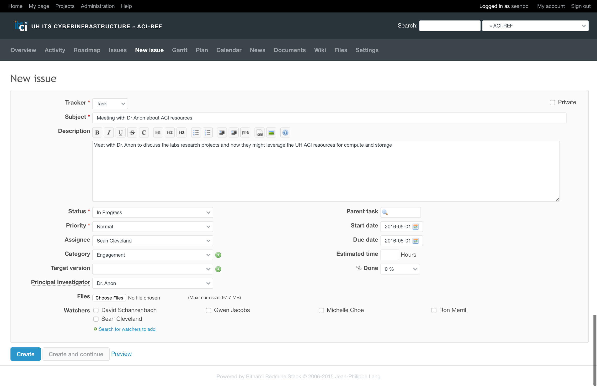
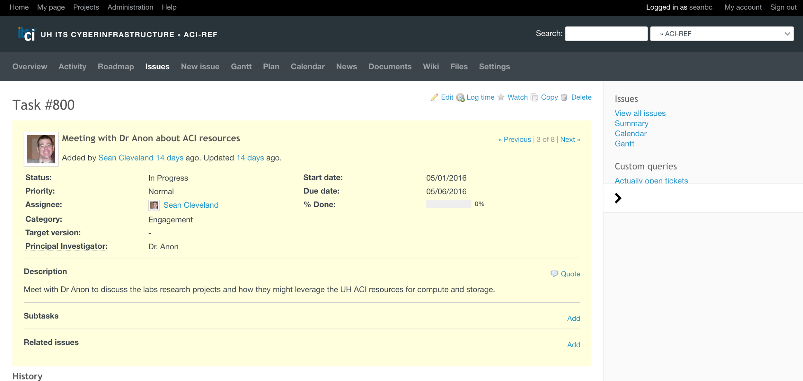
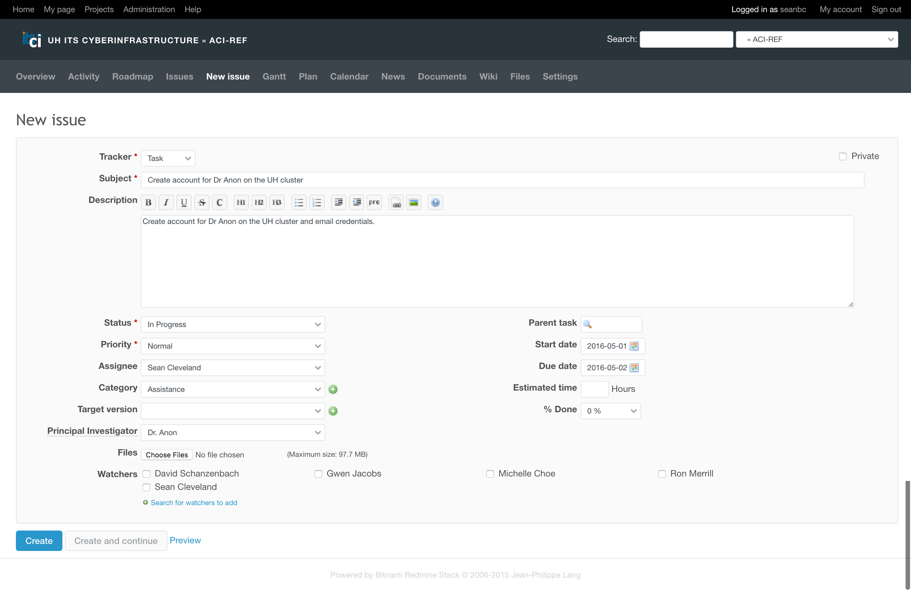
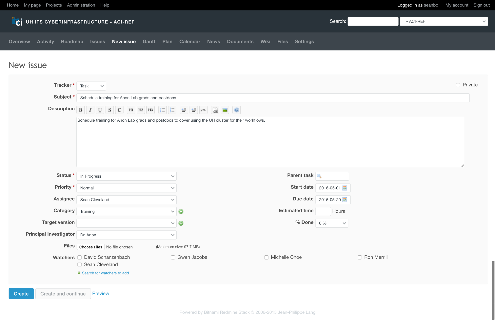
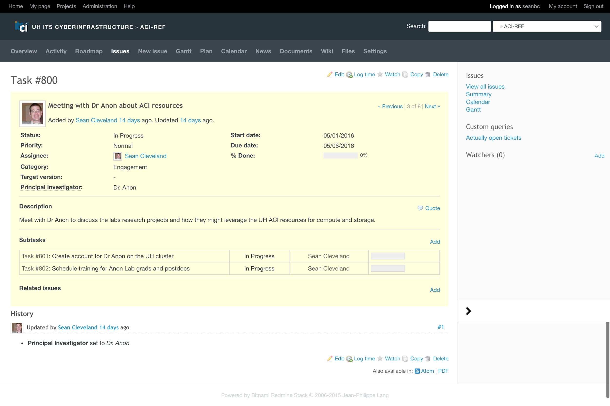
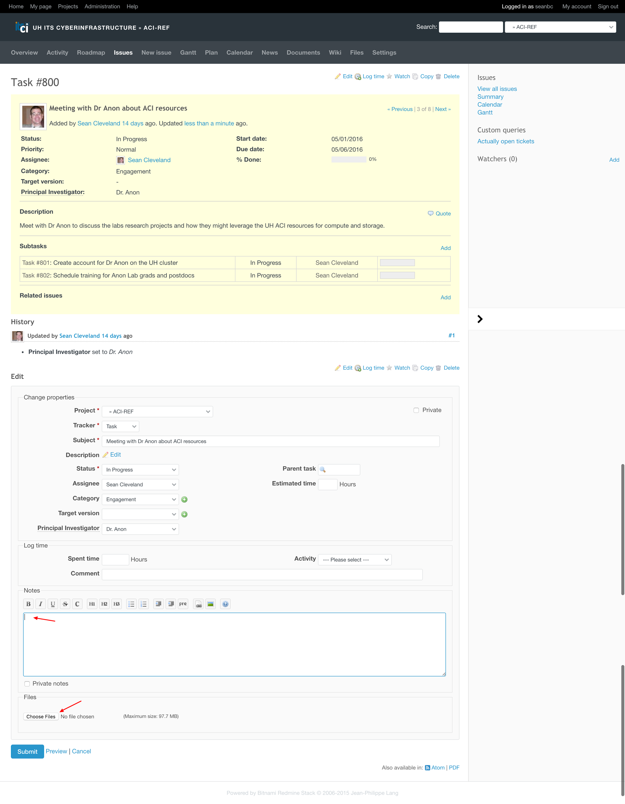
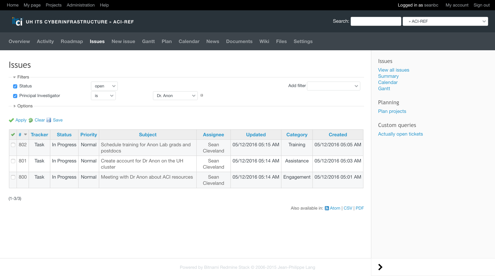
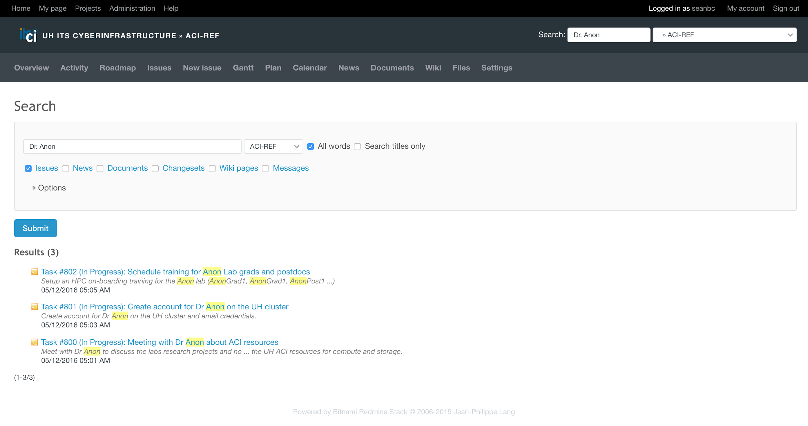

 

# Appendix 3-1 Example Engagement Documenation

 

The following example illustrates documenting, organizing, and capturing an end-to-end Engagement using the open source project management tool Redmine (http://www.redmine.org/), so that it can be shared, discovered, and tracked within your organization.

 

In this example, we will create a Redmine project to capture engagements with ACI researchers. A project is a place to organize issues, wiki information and documents. Hierarchically, a project is the top level object in Redmine. The next step, once we navigate inside the project, is to create a new issue and begin documenting our engagements.  An issue is an object that can be tracked in Redmine until it is considered resolved or closed.  They can be engagements, tasks or support tickets, for example; whatever you wish to define and track in a way that works for you in the context of the system.  

In this UH Redmine instance, we have created a project named *ACI-REF* and have added the researcher’s name to the list of *Principal Investigators*, which is a custom column that was created for this project in our version of Redmine. It does not exist by default like the other fields in the issue do.

 

In Figure 1, a new issue is being created for an engagement meeting that will occur with Dr. Anon to discuss the research that his/her lab is engaging in, during which we (the Facilitators) will cover the basic questions from the Engagement chapter to identify the ACI needs. In addition to the *Tracker*, *Subject*, and *Description* fields are the *Category* and *Principal Investigator*. In this example, the *Category* is set to 'engagement', another custom category that was defined by the local team managing Redmine.  The* Principal Investigator* field is a another custom field, one that has been defined in Redmine by the administrator for the purpose of filter and tracking issues in the ACI-REF project.

**Figure 1- First engagement issue**

 

**Figure 2 – Successful parent issue created for capturing an engagement.**

 

After the initial issue to capture this engagement has been created, additional sub-issues can be added via the "add" link in the *sub**tasks* section of the “Parent” issue (Task 800 in this example). Subsequent issues for tasks related to this engagement will be added as subtasks from the Parent issue.

 

 

**Figure 3 – Create Dr Anon’s account creation sub-issue**

 

Figures 3 and 4 illustrate creating two sub-issues for the meeting with Dr. Anon that are based on the outcomes of the initial engagement meeting. The first sub-issue is to create an account for Dr. Anon on the UH cluster. Note that the *Category* is set to *Assistance* and the *Principal Investigator* is set to *Dr. Anon*. This category assignment allows us to track assistance events in the system.  The second sub-issue is to schedule ACI training for Dr. Anon’s lab. For this sub issue we have set the *Category* to *Training* (Fig 4). These categories can be created on-the-fly, but we typically stick to *Engagement*, *Assistance*, and *Training* for the ACI-REF Project context.

 

 

 

**Figure 4:  Create sub-issue for training Dr. Anon’s lab.**

 

** Figure 5: Parent Issue with new Sub-Issues**

After creating the sub-issues for account creation and lab training, the Parent issue view displays two new issues in the *Subtasks* section (Figure 5). We now have captured the major tasks/issues resulting from the engagement meeting in our tracking system and can continue to add additional information or notes. For instance, if we choose to edit the Parent task, we can add additional notes, e.g., about the engagement meeting, in the Notes area, or we can upload a file, e.g., a Microsoft Word document that has responses to the engagement questions (Figure 6).

**Figure 6: Editing the Parent Issue**

Once we are satisfied that the engagement has been captured through issues, notes, and attached documents, we continue to manage the issues like we would in any ticketing system, until they are resolved.  Sometimes this means creating additional issues or sub-issues under  existing ones. For example, in the *issue* for training Dr. Anon’s lab group, we might add additional issues to create the lab team accounts on the cluster. It is up to us to decide if we want to make that a sub-issue of the initial engagement issue or of the lab training issue based on our hierarchical preferences. No matter how we define the hierarchy, we can always view all the issues and filter them as long as we have set the appropriate fields, such as *Category* and *Principal Investigator*.  For example, Figure 7 illustrates that we are filtering the issues that have Dr. Anon as Principal Investigator and have an *Open* status.  Additionally, filters can be added for most  other information fields in an issue, and it is possible to save a set of filters as a custom query that will be available in the Issue view as a link for easy reuse.

 

**Figure 7: Filtering and finding issues **

In addition to using query filters, Redmine supports a simple text-based search that can be scoped to a project and the issues, news, documents, changesets, wiki pages and messages within that project (Figure 8). This is an easy mechanism for finding all items relating to a given Principal Investigator, as long as the items contain the search phrase.

**Figure 8: Searching**

